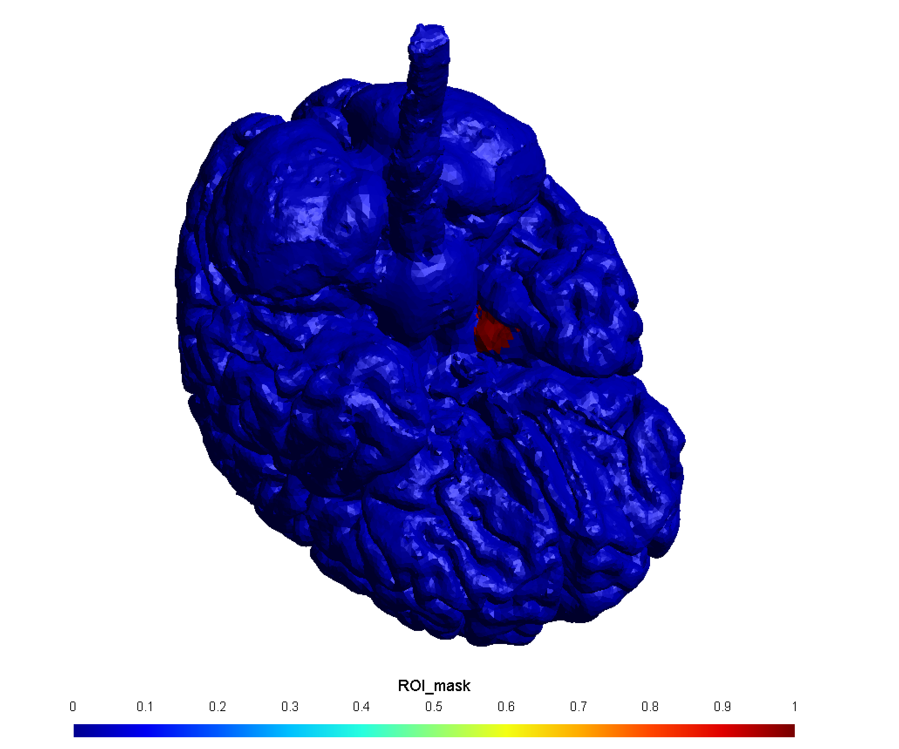
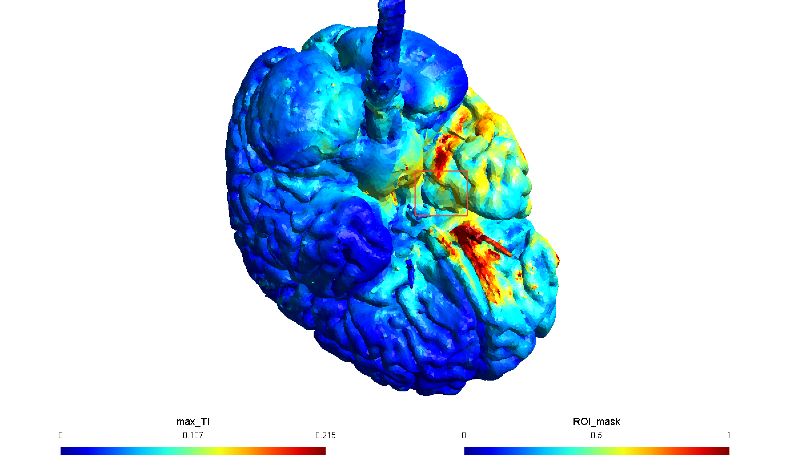

# TI 基于 Leadfield 的遗传算法逆向优化方案与验证结果

## 1. 目标与边界

### 1.1 目标

在不改变现有 leadfield-free TI 逆向仿真算法的前提下，新增一套可被 demo 调用的 leadfield-based 优化模块：

- 电极候选位置来自指定的固定 montage；
- 在 montage 的离散电极标签中优化两对电极的位置；
- 按论文方法同时选择两路电流，保持两路总和为 `2 mA`；
- 使用论文及配套代码采用的 `geneticalgorithm` 遗传算法库；
- 使用预计算 TDCS leadfield 快速计算每个候选方案的两路电场和 `max_TI`；
- 增加一个基于现有 `data/m2m_ernie` 数据的 demo，验证算法效果。

### 1.2 边界

- 不修改 `neuracle/ti_inverse.py` 当前使用的 `TesFlexOptimization` 算法、参数和输出。
- 不修改 `neuracle/ti_optimization/` 下的 leadfield-free 实现。
- 不增加新的 CLI 或业务入口，demo 是本阶段唯一的可运行入口。
- 不修改全局 `neuracle/parameters/` 数据结构和校验器；demo 直接构造新模块需要的 dataclass。
- 不修改 `simnibs/examples/optimization/TI_fields_leadfields.py` 和 `simnibs/utils/TI_utils.py`，只复用其 leadfield 数据约定、电极对线性组合和 `max_TI` 计算。
- 第一版只支持 atlas ROI，不考虑 `mni_pos` 球形 ROI。
- 按 `neuracle/CLAUDE.md` 约定不增加测试代码，通过 demo 及输出结果完成验证。

### 1.3 “固定 montage”与“优化电极位置”的含义

“固定 montage”表示候选电极标签及坐标固定，不是最终四个电极固定：

```text
固定 montage CSV
    └── 候选标签：Fp1、Fpz、...、PO7、P8、...
            └── GA 选择：A+、A-、B+、B-
```

遗传算法不会在头皮表面连续移动电极，只会从 montage 中选择四个离散标签。

## 2. 论文方法与本方案

依据论文 *Non-invasive stimulation with temporal interference: optimization of the electric field deep in the brain with the use of a genetic algorithm*（DOI：`10.1088/1741-2552/ac89b3`）及其公开配套代码（DOI：`10.5281/zenodo.5907211`）。

### 2.1 论文设置

| 项目 | 论文/配套代码设置 |
|---|---|
| 电极系统 | 10-10 EEG montage |
| 刺激结构 | 两对电极，共四个互不重复的电极 |
| 加速方式 | 预计算相对于参考电极的 leadfield，任意电极对通过 leadfield 相减得到 |
| 适应度 | 最大化 ROI 与其余脑区的平均 `max_TI` 比值 `ROI/Rest` |
| 强度约束 | ROI 内最大 `max_TI` 低于阈值时施加大惩罚 |
| GA 库 | `geneticalgorithm` |
| 种群规模 | 100 |
| 迭代代数 | 25 |
| mutation probability | 0.4 |
| crossover probability | 0.5 |
| parents portion | 0.1 |
| elit ratio | 0.01 |
| crossover type | uniform |
| 电流范围 | 每路 0.5–1.5 mA，步长 0.05 mA |
| 电流总和 | `I_A + I_B = 2 mA` |

### 2.2 电流如何参与优化

论文配套实现中，GA 染色体只包含四个电极索引。适应度函数会对当前四电极组合枚举全部合法电流组合，并选择其中适应度最高的一组：

```text
I_A ∈ {0.50, 0.55, ..., 1.50} mA
I_B = 2.00 - I_A
```

一共有 21 组合法组合。虽然电流不作为独立 GA 基因，但两路电流仍然被优化：对每个电极染色体完整搜索电流组合，然后把最佳 `I_A`、`I_B` 与该染色体绑定。第一版完全保持论文这种结构，不增加六基因染色体。

## 3. GA 库选型

### 3.1 采用 `geneticalgorithm`

本方案采用：

```text
geneticalgorithm==1.0.2
```

原因：

- 论文公开代码直接使用该库，参数可以逐项对应；
- 支持整数变量、elitism、uniform crossover 和适应度惩罚；
- 本问题只有四个整数基因，不需要复杂的多目标或约束框架；
- 库源码没有使用 NumPy 2 已删除的 `np.int`、`np.float` 别名。

当前 `simnibs_env` 中尚未安装 `geneticalgorithm` 和它依赖的 `func_timeout`。实现前先在 `simnibs_env` 安装固定版本，并运行一个四整数基因的最小 smoke check。正式 demo 将 `function_timeout` 设置为论文代码使用的 `120 s`，避免一次完整适应度计算超过库默认的 10 秒限制。

需要说明的是，`geneticalgorithm 1.0.2` 发布于 2020 年，维护状态较旧。因此只在本次论文复现 demo 中使用，不把它接入现有生产入口。

### 3.2 其他可选库

| 库 | 特点 | 本次是否采用 |
|---|---|---|
| PyGAD | 仍在活跃维护，核心依赖轻，支持自定义 fitness、parent selection、crossover 和 mutation | 否；如果后续不要求严格贴近论文代码，优先替代候选 |
| DEAP | 成熟、灵活，适合自定义个体、算子、并行和多种演化算法 | 否；本问题使用时需要编写更多模板代码 |
| pymoo | 单目标、多目标和约束优化能力完整 | 否；对当前四基因单目标问题过重 |

如果 `geneticalgorithm` 在 `simnibs_env` 的 smoke check 中出现实际兼容问题，再切换到 PyGAD，并在方案中逐项记录参数映射；不自行重写 GA。

## 4. 总体架构

现有链路保持不变，新模块仅由 demo 调用：

```text
现有 leadfield-free 链路
neuracle/ti_inverse.py -> TesFlexOptimization
                         （完全不变）

新增验证链路
neuracle/ti_leadfield_optimization/demo/ti_leadfield_ga_optimize_demo.py
    -> 配置 ernie、montage、atlas ROI 和 GA 参数
    -> 生成或复用 volumetric TDCS leadfield
    -> 一次性将完整 float64 leadfield 读入内存
    -> 构建 ROI/Rest element mask 与体积权重
    -> geneticalgorithm 优化四个电极索引
        -> 每个染色体内部枚举 21 组合法电流
    -> 在完整 WM+GM 网格复算最优方案
    -> 输出 JSON/CSV/MSH/NIfTI
    -> 用直接 FEM 进行最终对照
```

leadfield 的 FEM 计算只发生一次。GA 运行期间只做数组相减、缩放、`max_TI` 和指标统计。

## 5. Leadfield 设计

### 5.1 生成配置

使用 `simnibs.simulation.sim_struct.TDCSLEADFIELD`：

```python
leadfield.subpath = head_model_dir
leadfield.fnamehead = mesh_path
leadfield.pathfem = leadfield_output_dir
leadfield.eeg_cap = montage_csv
leadfield.field = "E"
leadfield.interpolation = None
leadfield.tissues = [ElementTags.WM, ElementTags.GM]
leadfield.anisotropy_type = anisotropy_type
leadfield.cond = cond
leadfield.fname_tensor = dti_file_path
```

电极模板与当前 TI 正向仿真保持一致：

- `shape = "ellipse"`；
- `dimensions = [2 * electrode_radius, 2 * electrode_radius]`；
- `thickness = 2.0 mm`；
- montage 决定电极圆心与方向。

必须使用 `interpolation = None` 并保留 WM、GM 四面体。`TI_fields_leadfields.py` 默认的 middle-GM surface leadfield 只适合皮层展示，不能验证深部海马 ROI。

### 5.2 HDF5 数据约定

沿用 `TI_utils.load_leadfield()` 的数据路径：

```text
/mesh_leadfield/
/mesh_leadfield/leadfields/tdcs_leadfield
```

dataset 形状为：

```text
(N_electrodes - 1, N_elements, 3)
```

HDF5 属性 `electrode_names` 和 `reference_electrode` 用于构建标签到 dataset row 的映射。参考电极没有独立 row，计算电极对时沿用 `TI_utils.get_field()` 的参考电极处理语义。

### 5.3 缓存

默认缓存目录：

```text
data/ti_leadfield_ga_ernie/
├── leadfield/
│   ├── ernie_leadfield_EEG10-10_UI_Jurak_2007.hdf5
│   └── leadfield_manifest.json
└── results/
```

manifest 记录：

- mesh 和 montage 路径、大小、修改时间及 SHA-256；
- 电极半径和厚度；
- conductivity、anisotropy 和 DTI 配置；
- tissues、field、SimNIBS 版本；
- dataset shape、dtype、reference electrode。

只有 manifest 完全一致才复用缓存。demo 是唯一调用方，第一版不设计跨任务并发锁。

### 5.4 `float64` 全量内存加载

当前 ernie 的 WM+GM 约有 `1,357,778` 个四面体。76 电极 montage 对应 75 个 leadfield row，完整 `float64` 数据约 `2.28 GiB`。目标计算机有 64 GiB 内存，第一版直接将完整 dataset 一次性读入内存，不转换为 `float32`。

`LeadfieldStore` 初始化时执行一次 HDF5 读取：

```python
with h5py.File(leadfield_path, "r") as h5:
    leadfield = np.asarray(
        h5["mesh_leadfield/leadfields/tdcs_leadfield"][...],
        dtype=np.float64,
    )
```

加载完成后关闭 HDF5 文件，GA 的所有适应度计算都从内存中取得电极 row，不再在迭代过程中读取硬盘，也不再需要 electrode-row LRU cache。

每次处理一个染色体时，仅为 `D_A`、`D_B`、缩放后的两路电场和 `max_TI` 创建必要的临时数组。实现时复用可预分配的工作数组，并在染色体计算结束后释放其余临时引用，避免 GA 迭代期间的峰值内存持续增长。

## 6. 优化变量与约束

### 6.1 GA 染色体

```text
[electrode_a_pos, electrode_a_neg,
 electrode_b_pos, electrode_b_neg]
```

对应结构：

```python
@dataclass(frozen=True)
class ElectrodeChromosome:
    electrode_indices: tuple[int, int, int, int]
```

这里需要四个候选电极，是因为 TI 使用两对电极，每对包含一个正极和一个负极：

```text
pair A = A+、A-
pair B = B+、B-
总计 2 × 2 = 4 个电极
```

论文要求这四个电极互不重复。因此，如果 montage 中可用且名称唯一的电极不足四个，就无法构成论文定义的两对独立电极，demo 在开始 GA 前直接报错。当前 ernie 的 montage 远多于四个，不会触发该错误。

### 6.2 电极约束

- 四个电极索引必须来自当前 montage；
- 四个索引必须互不相同；
- 重复电极组合按论文配套代码返回大惩罚，不额外实现染色体修复；
- `geneticalgorithm` 的整数变量边界设为 `[0, electrode_count - 1]`，库负责保证索引不越界。

### 6.3 电流候选

电流不参与 GA crossover 或 mutation，不存在 mutation 产生“越界电流”的情况。合法组合在优化开始前一次性生成：

```python
current_values = np.arange(0.5, 1.5 + 0.05, 0.05)
current_pairs = [
    (current_a, current_b)
    for current_a in current_values
    for current_b in current_values
    if np.isclose(current_a + current_b, 2.0)
]
```

最终应得到 21 组，每一路都满足 `0.5–1.5 mA`，两路总和满足 `2 mA`。

## 7. 电场与适应度

### 7.1 两路电场

leadfield 单位电流为 `1 A`。对当前电极染色体及某一组电流：

```text
D_A = L[A+] - L[A-]
D_B = L[B+] - L[B-]

E_A = (I_A / 1000) * D_A
E_B = (I_B / 1000) * D_B
max_TI = TI.get_maxTI(E_A, E_B)
```

每对电极的实际电流分别为 `[+I_A, -I_A]` 和 `[+I_B, -I_B]`，每个载波内部电流和为零。

### 7.2 Atlas ROI 与 Rest

第一版只支持 atlas ROI。使用 `simnibs.RegionOfInterest` 在 leadfield 自带的 WM+GM mesh 上生成 element mask：

```text
ROI  = WM+GM 中命中 atlas mask 的四面体
Rest = (WM+GM) - ROI
```

每个 element 使用 `mesh.elements_volumes_and_areas()` 返回的四面体体积作为权重：

```text
mean_roi  = sum(TI_k * volume_k, k in ROI)  / sum(volume_k, k in ROI)
mean_rest = sum(TI_k * volume_k, k in Rest) / sum(volume_k, k in Rest)
ratio     = mean_roi / mean_rest
```

ROI、Rest 为空或体积为零时立即抛出 `ValueError`。`mean_rest` 接近零时使用明确的 epsilon 保护，并记录日志，不能让 `NaN/Inf` 进入 GA。

### 7.3 每个染色体的电流搜索

对当前四电极组合遍历 21 组合法电流，并计算：

```text
roi_max   = max(max_TI_k, k in ROI)
base_score = 10000 * ratio

if roi_max < target_threshold:
    penalty = 1000 + 100 * (target_threshold - roi_max)^2
else:
    penalty = 0

score = base_score - penalty
```

选择 `score` 最大的电流组作为该电极染色体的结果。由于 `geneticalgorithm` 只支持最小化，传给库的目标值为：

```text
objective = -score
```

适应度返回标量，但通过内部 evaluation cache 保存对应的最佳 `I_A`、`I_B`、ratio、ROI/Rest 均值、ROI 最大值和 penalty，最终结果不能仅依赖库返回的一个负目标值。

## 8. 遗传算法调用

### 8.1 参数

```python
algorithm_parameters = {
    "max_num_iteration": 25,
    "population_size": 100,
    "mutation_probability": 0.4,
    "elit_ratio": 0.01,
    "crossover_probability": 0.5,
    "parents_portion": 0.1,
    "crossover_type": "uniform",
    "max_iteration_without_improv": None,
}
```

调用结构：

```python
optimizer = ga(
    function=objective,
    dimension=4,
    variable_type="int",
    variable_boundaries=np.array([[0, electrode_count - 1]] * 4),
    algorithm_parameters=algorithm_parameters,
    function_timeout=120.0,
    convergence_curve=False,
    progress_bar=True,
)
optimizer.run()
```

demo 调用前设置固定的 NumPy random seed，保存 `optimizer.report` 作为收敛曲线，并从 evaluation cache 取出最优染色体对应的最佳电流和指标。

### 8.2 运行期数据结构

新增模块内部 dataclass：

```python
@dataclass(frozen=True)
class CurrentPair:
    current_a_ma: float
    current_b_ma: float


@dataclass(frozen=True)
class ElectrodeChromosome:
    electrode_indices: tuple[int, int, int, int]


@dataclass(frozen=True)
class FitnessMetrics:
    objective: float
    score: float
    roi_rest_ratio: float
    roi_mean_v_per_m: float
    rest_mean_v_per_m: float
    roi_max_v_per_m: float
    penalty: float
    currents: CurrentPair


@dataclass(frozen=True)
class LeadfieldGAResult:
    chromosome: ElectrodeChromosome
    electrode_names: tuple[str, str, str, str]
    metrics: FitnessMetrics
    convergence: list[float]
    random_seed: int
```

demo 配置也使用本模块内的 `LeadfieldGADemoConfig`，不写入 `neuracle/parameters/schemas.py`。

## 9. 文件改造清单

### 9.1 新增算法模块

| 文件 | 职责 |
|---|---|
| `neuracle/ti_leadfield_optimization/__init__.py` | 导出 demo 需要的公共 API |
| `neuracle/ti_leadfield_optimization/models.py` | demo 配置、染色体、电流、适应度和结果 dataclass |
| `neuracle/ti_leadfield_optimization/leadfield.py` | 配置、生成和校验 volumetric leadfield，将完整 `float64` dataset 一次性加载到内存 |
| `neuracle/ti_leadfield_optimization/roi.py` | 解析多个 atlas 子区并集，生成 ROI/Rest mask 和体积权重 |
| `neuracle/ti_leadfield_optimization/fitness.py` | 枚举 21 组电流，计算 `max_TI`、ROI/Rest 和阈值惩罚 |
| `neuracle/ti_leadfield_optimization/optimizer.py` | 配置并调用 `geneticalgorithm`，维护 evaluation cache |
| `neuracle/ti_leadfield_optimization/result.py` | 写 JSON/CSV/MSH、`.opt` 和 NIfTI |

### 9.2 新增 demo

| 文件 | 职责 |
|---|---|
| `neuracle/ti_leadfield_optimization/demo/__init__.py` | demo 子包标记，不导出为业务入口 |
| `neuracle/ti_leadfield_optimization/demo/ti_leadfield_ga_optimize_demo.py` | 唯一运行入口；使用 ernie 数据生成/复用 leadfield、运行 GA 并验证效果 |

### 9.3 不修改

- `neuracle/ti_inverse.py`；
- `neuracle/ti_optimization/**`；
- `neuracle/parameters/**`；
- `simnibs/examples/optimization/TI_fields_leadfields.py`；
- `simnibs/utils/TI_utils.py`；
- `packing/pack.py`。

`packing/pack.py` 的忽略规则会递归排除名为 `demo` 的目录，因此调整后的 demo 仍不进入产品包。`geneticalgorithm` 只由 demo 执行路径延迟导入，不成为现有业务入口的运行时依赖。

## 10. 输出结构

```text
data/ti_leadfield_ga_ernie/
├── leadfield/
│   ├── ernie_leadfield_EEG10-10_UI_Jurak_2007.hdf5
│   └── leadfield_manifest.json
└── results/
    ├── baseline_metrics.json
    ├── optimization_result.json
    ├── convergence.csv
    ├── ti_leadfield_ga_result.msh
    ├── ti_leadfield_ga_result.msh.opt
    ├── ernie_leadfield_ga_max_TI.nii.gz
    └── final_validation/
        ├── optimized/
        ├── baseline/
        └── comparison.json
```

`optimization_result.json` 至少包含：

```json
{
  "algorithm": "leadfield_ga",
  "ga_library": "geneticalgorithm==1.0.2",
  "montage": "EEG10-10_UI_Jurak_2007",
  "electrode_A": [
    {"name": "...", "current_mA": 1.0},
    {"name": "...", "current_mA": -1.0}
  ],
  "electrode_B": [
    {"name": "...", "current_mA": 1.0},
    {"name": "...", "current_mA": -1.0}
  ],
  "current_constraints": {
    "minimum_per_pair_mA": 0.5,
    "maximum_per_pair_mA": 1.5,
    "step_mA": 0.05,
    "sum_mA": 2.0
  },
  "metrics": {
    "objective": 0.0,
    "score": 0.0,
    "roi_rest_ratio": 0.0,
    "roi_mean_v_per_m": 0.0,
    "rest_mean_v_per_m": 0.0,
    "roi_max_v_per_m": 0.0,
    "penalty": 0.0
  },
  "ga": {"random_seed": 20220815, "generations": 25},
  "leadfield": {"path": "...", "manifest_sha256": "..."}
}
```

结果 mesh 写入：

- `E_magn_A`；
- `E_magn_B`；
- `max_TI`；
- `ROI_mask`；
- `Rest_mask`。

## 11. Demo 与效果验证

### 11.1 数据和配置

demo：`neuracle/ti_leadfield_optimization/demo/ti_leadfield_ga_optimize_demo.py`

使用现有数据：

- 头模：`data/m2m_ernie/ernie.msh`；
- T1：`data/m2m_ernie/T1.nii.gz`；
- montage：`data/m2m_ernie/eeg_positions/EEG10-10_UI_Jurak_2007.csv`；
- atlas：`neuracle/atlas/standardized/BN_Atlas_246_1mm/`；
- ROI：`rHipp_R` 与 `cHipp_R` 的并集，表示完整右侧海马；
- target threshold：`0.2 V/m`；
- 电流：每路 `0.5–1.5 mA`、步长 `0.05 mA`、总和 `2 mA`；
- GA：论文默认参数，固定 random seed。

### 11.2 Baseline

使用论文给出的未优化配置：

```text
pair A = PO7 - F7, 1.25 mA
pair B = P8 - FC6, 0.75 mA
```

这四个标签已存在于 ernie 的 montage，且电流总和为 2 mA。

### 11.3 Demo 流程

1. 检查 ernie mesh、T1、montage 和两个 Brainnetome ROI 子区文件。
2. 若缓存不存在，基于 ernie、固定 montage、WM+GM 生成 volumetric TDCS leadfield；存在则校验 manifest 后复用。随后将完整 `float64` leadfield 一次性读入内存并关闭 HDF5 文件。
3. 构建完整右侧海马 ROI 与 Rest mask，打印 element 数量和体积。
4. 在运行 GA 之前，先用 leadfield 计算论文 baseline 的 `score`、ROI/Rest ratio、ROI/Rest 均值和 ROI 最大值，保存到 `baseline_metrics.json`。这一步只建立效果对照，不参与 GA 初始化，也不改变随机种群。
5. 设置固定 random seed，调用 `geneticalgorithm` 执行 100 个体、25 代优化；每个电极染色体内部枚举 21 组电流。
6. 从 evaluation cache 取得全局最优电极和对应的最佳两路电流，并在完整 WM+GM element 上复算。
7. 输出相对 baseline 的指标变化、收敛 CSV、结果 JSON、MSH 和 NIfTI。
8. 使用当前 `neuracle.ti_forward` 对 baseline 和 optimized 配置各运行一次直接 FEM。
9. 在相同 ROI/Rest 定义下比较 leadfield 与直接 FEM 的 `roi_mean`、`rest_mean`、`roi_max` 和 ratio，写入 `comparison.json`。

### 11.4 验收条件

- `geneticalgorithm==1.0.2` 能在 `simnibs_env` 完成最小 smoke check；
- leadfield dataset 的 field 为 `E`、单位为 `V/m`、数据类型为 element data；
- leadfield element 数量与 WM+GM 四面体数量一致；
- GA 染色体只包含四个 montage 电极索引；
- 最终四个电极均来自指定 montage 且互不重复；
- 最终 `I_A`、`I_B` 均在 `0.5–1.5 mA`，步长为 `0.05 mA`，且 `I_A + I_B = 2 mA`；
- 每对电极电流为 `[+I, -I]`，对内电流和为零；
- `roi_max >= target_threshold`；所有候选均未达到阈值时，demo 明确失败；
- optimized score 高于 baseline score，否则 demo 报告“本次 GA 未取得效果提升”，不把结果标记为验证通过；
- JSON、CSV、MSH 和 NIfTI 均存在且字段可读取；
- leadfield 最优解和最终直接 FEM 的关键指标方向一致；首版以 5% 相对误差为核查阈值，超过时检查电极几何、conductivity、anisotropy、网格域和单位；
- 第二次运行能够复用相同 leadfield，并在相同 random seed 下获得相同结果。

## 12. 实施顺序

1. 在 `simnibs_env` 安装 `geneticalgorithm==1.0.2`，完成 NumPy 2.3 和四整数变量 smoke check。
2. 实现运行期 dataclass 和 21 组合法电流生成。
3. 实现 volumetric leadfield 生成、manifest 校验和完整 `float64` dataset 的一次性内存加载。
4. 实现 atlas 子区并集、ROI/Rest element mask 和体积权重。
5. 实现单个电极染色体内的 21 组电流枚举及适应度缓存。
6. 接入 `geneticalgorithm`，配置论文 GA 参数和固定 seed。
7. 实现结果 JSON/CSV/MSH/NIfTI 输出。
8. 增加 ernie demo，计算 baseline、运行 GA，并执行最终直接 FEM 对照。
9. 检查 `git diff`，确认 `ti_inverse.py`、`ti_optimization/` 和 `parameters/` 没有行为变化。

## 13. 实际运行结果与误差分析

### 13.1 运行配置与产物

2026 年 8 月 17 日已在 `simnibs_env` 中完整运行：

```text
conda run -n simnibs_env python -m neuracle.ti_leadfield_optimization.demo.ti_leadfield_ga_optimize_demo
```

本次运行使用第 11.1 节记录的论文电流约束，即每路 `0.5–1.5 mA`、步长
`0.05 mA`、两路幅值之和为 `2 mA`。本节结果只适用于该配置，不能直接代表
其他独立电流上限或总电流策略下的优化结果。

实际生成的 volumetric leadfield 及 ROI/Rest 规模如下：

| 项目 | 实际值 |
|---|---:|
| Leadfield shape | `(75, 1,357,778, 3)` |
| Leadfield dtype | `float64` |
| 参考电极 | `Cz` |
| ROI element 数 | `5,370` |
| Rest element 数 | `1,352,408` |

ROI 仍为 Brainnetome atlas 中 `rHipp_R` 与 `cHipp_R` 的并集，即右侧海马嘴侧部和
尾侧部；Rest 为 WM/GM 四面体中扣除该 ROI 后的其余区域。

运行生成的主要结果位于：

```text
data/ti_leadfield_ga_ernie/results/
├── baseline_metrics.json
├── optimization_result.json
├── convergence.csv
├── ti_leadfield_ga_result.msh
├── ernie_leadfield_ga_max_TI.nii.gz
└── final_validation/
    ├── baseline/
    ├── optimized/
    └── comparison.json
```

### 13.2 GA 最优解与 baseline 对照

GA 在第 16 代达到本次最终最优值，随后保持至第 25 代。得到的最优配置为：

```text
pair A = C1 - F4,   1.05 mA
pair B = T10 - P10, 0.95 mA
```

Leadfield 指标对照如下：

| 指标 | 论文 baseline | GA 最优解 | 变化 |
|---|---:|---:|---:|
| score | `14,322.60` | `18,944.58` | `+32.27%` |
| ROI/Rest ratio | `1.432260` | `1.894458` | `+32.27%` |
| ROI mean `(V/m)` | `0.131297` | `0.116252` | `-11.46%` |
| Rest mean `(V/m)` | `0.091671` | `0.061364` | `-33.06%` |
| ROI max `(V/m)` | `0.290700` | `0.243822` | `-16.13%` |

直接 FEM 对照如下：

| 指标 | 论文 baseline | GA 最优解 | 变化 |
|---|---:|---:|---:|
| ROI/Rest ratio | `1.432131` | `1.895266` | `+32.34%` |
| ROI mean `(V/m)` | `0.133460` | `0.125357` | `-6.07%` |
| Rest mean `(V/m)` | `0.093190` | `0.066142` | `-29.02%` |
| ROI max `(V/m)` | `0.305495` | `0.253840` | `-16.91%` |

Leadfield 和直接 FEM 都确认 ROI/Rest ratio 提升约 `32.3%`，且最优解的 ROI max
仍高于 `0.2 V/m`。同时必须注意，当前适应度最大化的是 ROI/Rest ratio，而不是
ROI mean 或 ROI max；本次 ratio 提升主要来自 Rest 场下降幅度大于 ROI 场下降幅度，
不能将该结果表述为“右海马绝对场强得到提高”。

### 13.3 当前程序的最终验收结果

`comparison.json` 中的最终 `passed` 对全部验证项执行 `all()`。本次四项结果为：

| 验证项 | 实际结果 |
|---|---|
| Leadfield 最优 score 高于 baseline | 通过 |
| Leadfield 最优 ROI max 不低于 `0.2 V/m` | 通过 |
| 直接 FEM 最优 ROI/Rest ratio 高于 baseline | 通过 |
| Leadfield 与直接 FEM 的全部指标相对误差不超过 `5%` | **未通过** |

相对误差按下式计算：

```text
abs(leadfield - direct_fem)
-----------------------------------------------
max(abs(leadfield), abs(direct_fem), float64_eps)
```

八个指标的实际误差如下：

| 方案 | ROI mean | Rest mean | ROI/Rest ratio | ROI max |
|---|---:|---:|---:|---:|
| baseline | `1.6211%` | `1.6300%` | `0.0090%` | `4.8429%` |
| GA 最优解 | `7.2635%` | `7.2240%` | `0.0427%` | `3.9464%` |

最大误差为 GA 最优解 ROI mean 的 `7.2635%`，超过首版固定的 `5%` 门槛，因此：

```text
leadfield_fem_relative_error_within_5_percent = false
passed = false
```

该失败发生在所有 GA、结果导出和两组直接 FEM 均完成之后，是最终跨模型一致性验收
失败，不是 GA 中断、FEM 失败或结果文件缺失。

### 13.4 Leadfield 与直接 FEM 的误差定位

#### 13.4.1 电场空间分布基本一致

将 leadfield 重建电场与直接 FEM 的 WM/GM element 逐向量对齐后，四个电极对的
cosine 均大于 `0.99998`。最优解两路电场的直接 FEM/leadfield 幅值关系为：

| 电极对 | 直接 FEM/leadfield 最佳缩放 | cosine | 去除缩放后的相对残差 |
|---|---:|---:|---:|
| `C1-F4` | `1.046066` | `0.999985` | `0.5429%` |
| `T10-P10` | `1.091019` | `0.999994` | `0.3373%` |

两路合成后的 `max_TI` 最佳缩放约为 `1.073504`，cosine 为 `0.999813`。因此本次
差异主要表现为幅值缩放，而不是电场方向或空间分布错误；也没有证据表明
leadfield 行相减、mA/A 换算或 `max_TI` 线性重建实现有误。

#### 13.4.2 Neumann 与 Dirichlet 边界条件不同

`TDCSLEADFIELD` 使用 `TDCSFEMNeumann`：参考电极接地，当前电极通过面积权重在
表面施加指定电流。`neuracle.ti_forward` 的普通 TDCS 正向仿真使用
`TDCSFEMDirichlet`：两个电极表面设为等电位，求解后根据计算得到的电极通量将
整个电位场缩放到目标电流。

在完全相同的双电极网格上仅切换这两种求解方式，得到：

| 电极对 | Dirichlet/Neumann 幅值比例 | cosine |
|---|---:|---:|
| `C1-F4` | `1.029482` | `1.000000` |
| `T10-P10` | `1.079872` | `1.000000` |

这部分分别贡献约 `2.95%` 和 `7.99%` 的幅值差异，是最优解误差的主要来源。
两种方法都由 SimNIBS 提供，但它们离散的是不同电极边界条件，不能仅根据导电方程
的线性性预期绝对幅值完全一致。

SimNIBS 日志中的 `Estimated current calibration error` 是两个电极通量估计的不平衡度，
不是上表的整体缩放比例，不能直接用该日志百分比代替实际电场误差。

#### 13.4.3 全 montage 固定网格与双电极网格不同

Leadfield 先将完整 montage 的 76 个电极全部放入网格并组装一个固定 FEM 矩阵；
每个 leadfield row 只改变当前电极与参考电极的电流右端项。其余电极没有外部净
注入电流，但仍作为浮置的高导电电极/导电介质区域保留在计算域中，会轻微改变
局部电流路径。直接 FEM 每路只在网格中放置当前两个电极。

目标电极在两类网格中的表面三角形数、节点数和面积完全相同，因此该误差不是目标
电极尺寸变化造成的。在保持 Neumann 边界条件不变、只切换计算网格后，得到：

| 电极对 | 双电极网格/全 montage 网格幅值比例 | cosine |
|---|---:|---:|
| `C1-F4` | `1.016108` | `0.999984` |
| `T10-P10` | `1.010321` | `0.999993` |

这部分分别贡献约 `1.61%` 和 `1.03%` 的幅值差异，是为了使用一套固定 leadfield
覆盖全部候选电极组合而引入的模型近似。两个来源相乘可还原最终差异：

```text
C1-F4:   1.029482 × 1.016108 = 1.046066
T10-P10: 1.079872 × 1.010321 = 1.091019
```

如果真实实验只放置最终四个刺激电极，双电极/四电极网格更接近最终物理配置；如果
真实实验确实佩戴整套包含导电介质的电极帽，则全 montage 网格也可能具有物理意义。

### 13.5 结论与后续验收建议

本次运行可以得出以下结论：

1. GA 找到了相对于论文 baseline 更高的 ROI/Rest ratio，leadfield 与直接 FEM 对
   `32.3%` 左右的提升方向和幅度高度一致。
2. 当前程序按既定规则仍应记录为 `passed=false`，唯一失败项是跨 Neumann 全 montage
   leadfield 与 Dirichlet 双电极 FEM 的全部绝对指标必须在 `5%` 内。
3. 受控对照表明该失败主要来自边界条件、电流归一化和固定计算域的模型差异，不是
   leadfield 线性叠加实现错误。
4. 当前目标优化的是焦度比。本次 ROI mean 和 ROI max 均下降；如果产品目标是提高
   ROI 绝对场强，需要另行调整适应度，不能通过放宽验证阈值解决。

后续若调整验收逻辑，建议拆分为两个层次：

- **Leadfield 实现正确性**：在相同全 montage 网格上使用直接 Neumann 求解，与
  leadfield 重建结果比较，验证固定线性模型中的数值一致性。
- **最终方案物理复核**：继续使用 Dirichlet 直接 FEM，将 ROI/Rest ratio、空间
  cosine 和绝对幅值偏差分别报告；ROI 强度阈值以直接 FEM 结果为最终依据。

在代码尚未按上述建议调整前，不应仅修改文档或把 `5%` 提高到更宽阈值后宣称现有
验收通过；本节如实保留本次运行的 `passed=false` 结论。

### 13.6 运行耗时

根据 `debug.log` 的首条主流程日志时间和 `comparison.json` 的创建时间，本次运行
可确认的主流程起止时间为 `2026-08-17 17:47:27` 至 `2026-08-17 19:45:02`，
总耗时为 **1 小时 57 分 35 秒**。该统计不包含运行结束后的人工排查和补充诊断时间。

| 阶段 | 起止时间 | 耗时 |
| --- | --- | ---: |
| 生成 leadfield | 17:47:27–18:05:00 | 17 分 33 秒 |
| 加载 leadfield | 18:05:00–18:05:13 | 13 秒 |
| 构建首次 ROI 与优化准备 | 18:05:13–18:07:06 | 1 分 53 秒 |
| 遗传算法优化 | 18:07:06–19:35:45 | 1 小时 28 分 39 秒 |
| 优化结果 mesh/NIfTI 导出 | 19:35:45–19:36:46 | 1 分 1 秒 |
| baseline 直接 FEM、TI 和 NIfTI | 19:36:46–19:39:15 | 2 分 29 秒 |
| optimized 直接 FEM、TI 和 NIfTI | 19:39:15–19:41:49 | 2 分 34 秒 |
| baseline 直接 FEM ROI 统计 | 19:41:49–19:43:27 | 1 分 38 秒 |
| optimized 直接 FEM ROI 统计及比较结果写入 | 19:43:27–19:45:02 | 1 分 35 秒 |

其中遗传算法优化约占总耗时的 **75%**，是本次运行的主要耗时阶段；leadfield 的
首次生成约占 15%。最终验证虽未通过，但失败发生在上述计算和结果写入完成之后，
因此不影响这里对本次完整主流程运行耗时的统计。

### 13.7 Gmsh 聚焦可视化与结果分析

`ti_leadfield_ga_result.msh` 同时保存了 `ROI_mask` 和 `max_TI` element field。
本次 ROI 为 Brainnetome `rHipp_R` 与 `cHipp_R` 的并集，即完整右侧海马。图 1
单独显示 `ROI_mask`，红色区域为右侧海马 ROI。



图 2 在相同视角显示 `max_TI`，并保留 ROI 的位置参考。明显的红色和黄色高场区域
主要位于 ROI 之外；ROI 附近以青色和绿色为主，没有形成全脑最高 TI 热点。



可视化判断与 mesh element field 的定量统计一致：

| 指标 | 数值 |
| --- | ---: |
| 右侧海马 ROI 体积加权平均 TI | 0.116252 V/m |
| 其余 WM/GM 体积加权平均 TI | 0.061364 V/m |
| ROI/Rest mean ratio | 1.894458 |
| ROI 内最大 TI | 0.243822 V/m |
| ROI 外最大 TI | 2.290757 V/m |
| ROI 外最大值 / ROI 内最大值 | 约 9.4 |
| 全脑 WM/GM 峰值是否位于 ROI | 否 |

图 2 的 Gmsh 色标上限为 `0.215 V/m`，低于 mesh 中的 ROI 内最大值
`0.243822 V/m`，也远低于 ROI 外最大值 `2.290757 V/m`。因此超过色标上限的
element 都显示为相同的红色，截图不能表现各高值区域之间的真实幅值差异；但这不
改变高场热点主要位于 ROI 外的空间结论。

本次 GA 的 ratio 提升还需要结合 baseline 分解判断：

| Leadfield 指标 | Baseline | GA 最优解 | 变化 |
| --- | ---: | ---: | ---: |
| ROI mean | 0.131297 V/m | 0.116252 V/m | 下降约 11.5% |
| Rest mean | 0.091671 V/m | 0.061364 V/m | 下降约 33.1% |
| ROI/Rest mean ratio | 1.432260 | 1.894458 | 上升约 32.3% |

也就是说，ratio 的改善主要来自 Rest 平均值下降得更快，而不是 ROI 场强增强。
当前 `0.2 V/m` 阈值只要求 `ROI max >= 0.2 V/m`，不限制 ROI 外峰值；同时 Rest
覆盖几乎全部非 ROI 的 WM/GM，局部 ROI 外强热点容易被巨大的 Rest 体积稀释。

因此，本次结果应表述为：**右侧海马相对于全脑平均背景的 TI 比值获得提升，但未在
“全脑高场热点位于右侧海马”的意义上实现聚焦。** 若后续目标是热点空间聚焦，需要
在适应度和验收条件中增加 ROI 外峰值惩罚、高场区域与 ROI 的体积重合率，以及 ROI
邻近非目标区约束，并继续以 optimized 直接 FEM 结果作为最终复核依据。
